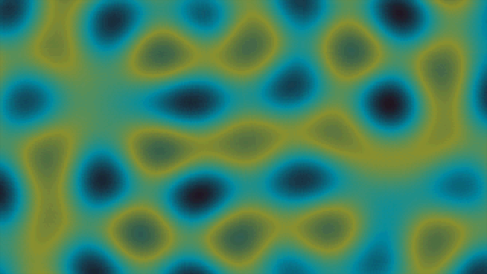

# Plasma Effects in assembly

Trying to understand how plasma effects were created and use it as an excuse to learn Assembly.

# To use it:

```bash
make
make run
```

And after press whitespace to see it running.


